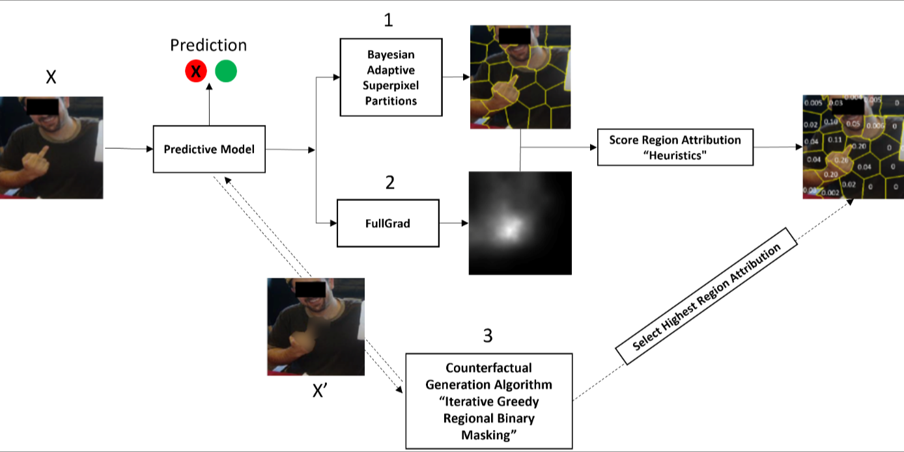

## __CSE__
Causal Subobject Explanations

For IJCAI 2023 submission

## __Abstract__

Automatic obfuscation of regions in images using
machine learning explanation has emerged as a crit-
ical problem in recent times. However, explanation
for image obfuscation demands pinpointing spe-
cific subobject regions of the input that are causal
of a model’s particular decision, because subobject
regions are human-understandable features, and
causal explanation enables a user to understand
what region caused a prediction for which it was
masked. Existing explanation approaches can
only provide attributions at a feature level and
cannot address the need for region-level causal
explanations. In this work, we propose a technique
called Causal Subobject Explanations (CSE) that
are counterfactual explanations produced based
on an adaptive region binary masking algorithm
with region attribution score heuristics, to identify
the regions in the image that caused the model’s
prediction to change. Extensive experiments on
a baseline dataset demonstrates the effectiveness
of CSE compared with five state-of-the-art ex-
plainability and four clustering approaches in
terms of three evaluation metrics. Furthermore,
we demonstrate the practicality of CSEs for three
datasets of harmful images, to automatically
obfuscate the harmful regions in these images,
thereby rendering them safe.

This code provides the implementation of the CSE algorithm.

# Code environment setup

#### Requirements
- captum==0.5.0
- dask_image==2021.12.0
- grad_cam==1.3.9
- matplotlib==3.5.0
- more_itertools==9.0.0
- numpy>=1.21.5
- opencv_python_headless==4.5.5.64
- Pillow==9.4.0
- scikit_image==0.19.3

# Install from pip

`pip install torch==1.12.0+cu113 torchvision==0.13.0+cu113 torchaudio==0.12.0 --extra-index-url https://download.pytorch.org/whl/cu113`

`pip -r requirements.txt`

## License
As a free open-source implementation, our repository is distributed on an "AS IS" BASIS, WITHOUT WARRANTIES OR CONDITIONS OF ANY KIND, either express or implied. All other warranties including, but not limited to, merchantability and fitness for purpose, whether express, implied, or arising by operation of law, course of dealing, or trade usage are hereby disclaimed. I believe that the programs compute what I claim they compute, but I do not guarantee this. The programs may be poorly and inconsistently documented and may contain undocumented components, features or modifications. I make no guarantee that these programs will be suitable for any application.